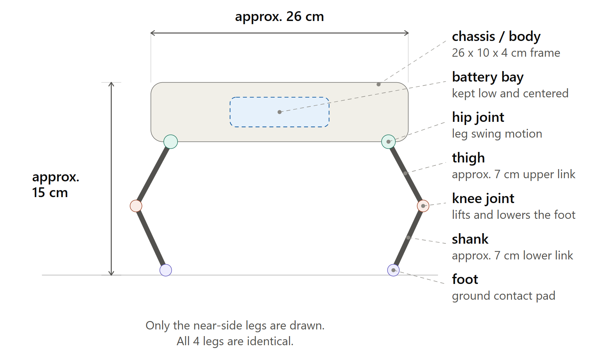

# MechanicalDesign-RobotDog


## ⚙️ Task1 - Mechanical Design of a simple Robot Dog


## Introduction

The purpose of this task is to create an initial mechanical design for a simple robot dog and understand the basic principles that allow the robot to stand, maintain balance, and walk. This is only the planning stage.

---

## Body Structure

The robot uses a simple rectangular chassis with four legs mounted at the corners. I went with a rectangular shape because it's easy to manufacture, easy to modify later, and leaves enough room inside for the battery and electronics.

The battery and other heavy parts are placed near the center of the body. Keeping the weight centered (and low) helps balance and lowers the chance of tipping over.

---

## Leg Design

The robot uses four identical legs. Each leg has two joints:

- **Hip joint** – moves the leg forward and backward
- **Knee joint** – lifts and lowers the foot during walking

A single-joint leg would've been simpler to build, but it doesn't give enough control over step height. Two joints per leg still keeps things manageable while giving more control, so that's what we went with.

---

## Joints and Degrees of Freedom (DOF)

| Item | Value |
|------|-------|
| Number of legs | 4 |
| Joints per leg | 2 |
| Total joints | 8 |
| Degrees of Freedom (DOF) | 8 |

So each leg contributes 2 DOF (hip + knee), for 8 total across the robot.

---

## Motor Selection

**Motor used: MG996R Servo Motor**

MG996R made sense here mainly because of the torque. It's rated well above the ~0.26 N·m minimum calculated below, which leaves some margin. It also runs on a standard PWM signal, so it works directly with Arduino, and it's cheap and easy to find, which matters for a first prototype.

---

## Preliminary Torque Calculation

**Assumptions:**
- Robot weight = 1.5 kg
- Load per supporting leg ≈ 0.375 kg (worst case: 3 legs supporting the body)
- Distance from joint (leg length) = 0.07 m

**Calculation:**

```
F = m × g
F = 0.375 × 9.81 ≈ 3.68 N

τ = F × r
τ = 3.68 × 0.07 ≈ 0.26 N·m
```

This is only a rough static estimate. It doesn't include friction, the leg's own weight, or acceleration while walking, so the real required torque is probably higher. That's part of why a motor with more torque than the calculated minimum was chosen.

---

## Stability and Center of Gravity

A few things were kept in mind to keep the robot stable:

- Heavy components (mainly the battery) sit near the center of the body
- The center of gravity is kept as low as the chassis allows
- The legs are spaced to create a wide support base

As long as the center of gravity stays inside the area formed by the legs touching the ground, the robot should stay upright.

---

## Proposed Walking Method

The plan is to use a slow, static walking gait, where only one leg lifts at a time while the other three stay on the ground. We also thought about a trot gait, which moves two diagonal legs together and would be faster, but it seemed riskier for a first design since fewer feet stay on the ground at once. We went with the static gait for now since it's more stable.

---

## ⚠️ Expected Mechanical Challenges

A few issues are likely to come up once this moves past the planning stage:

- Insufficient motor torque under real (non-ideal) load
- Foot slipping on smooth surfaces
- Joint misalignment from manual assembly
- Mechanical vibration during walking
- Motor overheating during long standing/operation periods

---



## Conclusion

This design focuses on understanding the mechanical principles behind quadruped robots, mainly structure, motion, stability, and torque, rather than producing a finished robot. The main goal of this task was to understand the mechanical concepts required to make the robot stand and walk.
